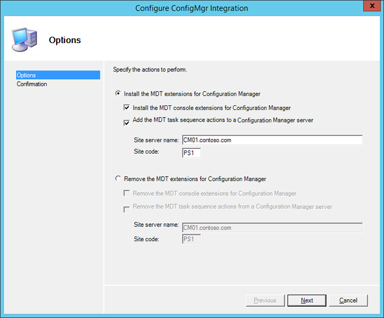
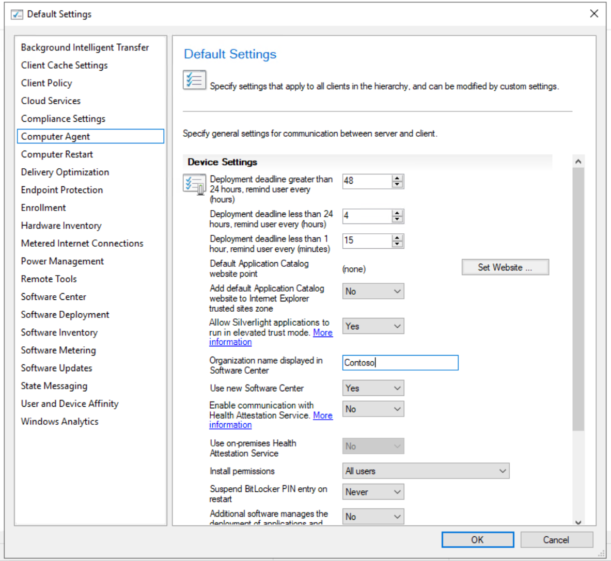
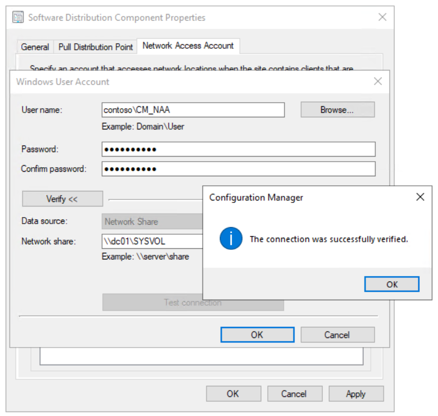
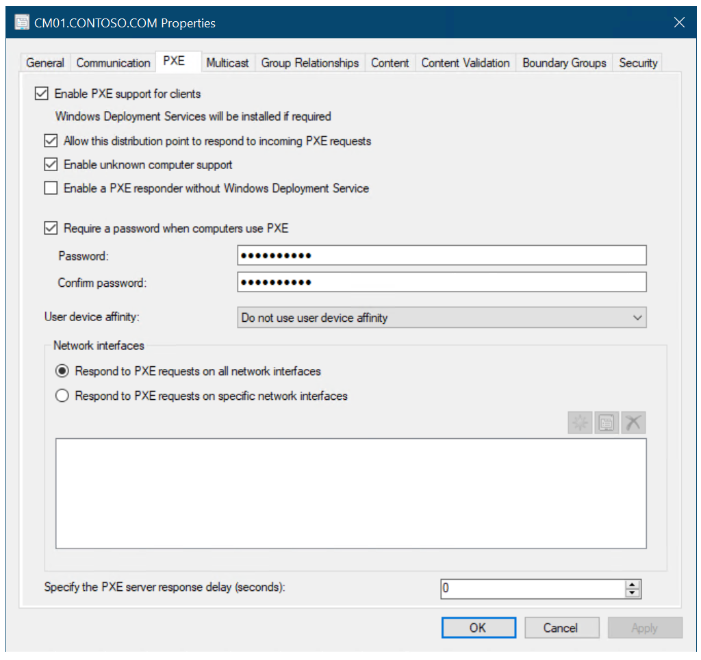
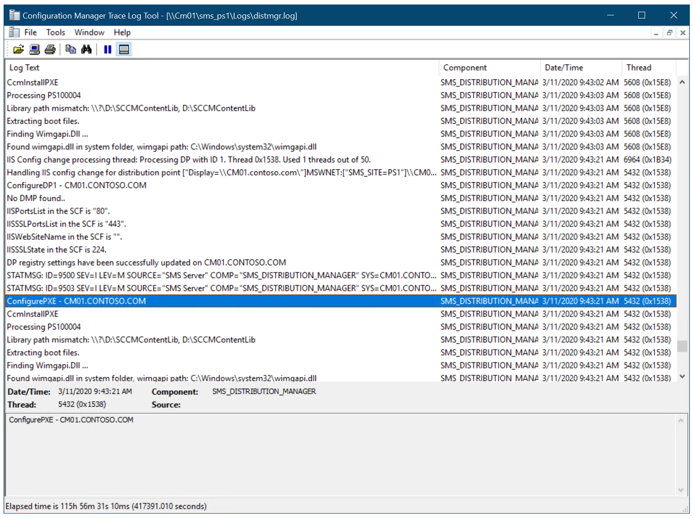
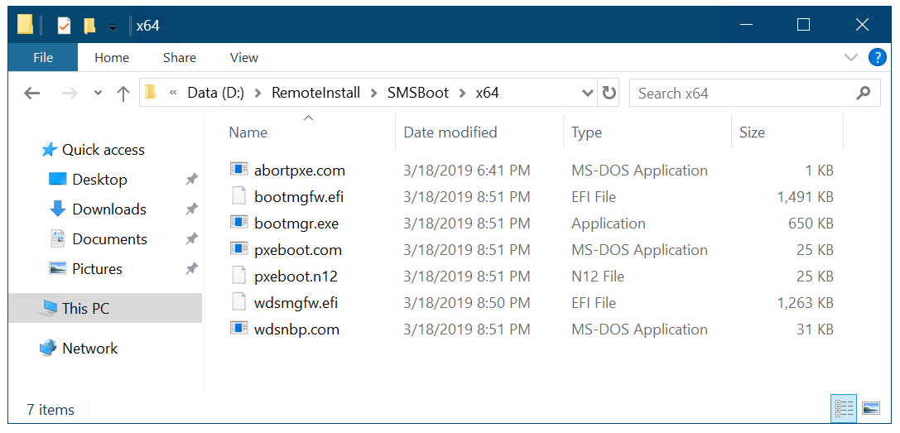

# Prepare for Zero Touch Installation of Windows 10 with Configuration Manager

**Applies to**

-   Windows 10

This topic will walk you through the Zero Touch Installation process of Windows 10 operating system deployment (OSD) using Microsoft Endpoint Configuration Manager (ConfigMgr) [integrated](#why-integrate-mdt-with-configuration-manager) with Microsoft Deployment Toolkit (MDT). 

## Prerequisites

In this topic, you will use [components](#components-of-configuration-manager-operating-system-deployment) of an existing Configuration Manager infrastructure to prepare for Windows 10 OSD. In addition to the base setup, the following configurations should be made in the Configuration Manager environment:

- Configuration Manager current branch + all security and critical updates are installed.
  - Note: Procedures in this guide use ConfigMgr 1910. For information about the version of Windows 10 supported by ConfigMgr, see [Support for Windows 10](https://docs.microsoft.com/configmgr/core/plan-design/configs/support-for-windows-10).
- The [Active Directory Schema has been extended](https://docs.microsoft.com/configmgr/core/plan-design/network/extend-the-active-directory-schema) and System Management container created.
- Active Directory Forest Discovery and Active Directory System Discovery are [enabled](https://docs.microsoft.com/configmgr/core/servers/deploy/configure/configure-discovery-methods).
- IP range [boundaries and a boundary group](https://docs.microsoft.com/configmgr/core/servers/deploy/configure/define-site-boundaries-and-boundary-groups) for content and site assignment have been created.
- The Configuration Manager [reporting services](https://docs.microsoft.com/configmgr/core/servers/manage/configuring-reporting) point role has been added and configured.
- A file system folder structure and Configuration Manager console folder structure for packages has been created. Steps to verify or create this folder structure are [provided below](#review-the-sources-folder-structure).
- The [Windows ADK](https://docs.microsoft.com/windows-hardware/get-started/adk-install) (including USMT) version 1903, Windows PE add-on, WSIM 1903 update, [MDT](https://www.microsoft.com/download/details.aspx?id=54259) version 8456, and DaRT 10 (part of [MDOP 2015](https://my.visualstudio.com/Downloads?q=Desktop%20Optimization%20Pack%202015)) are installed.
- The [CMTrace tool](https://docs.microsoft.com/configmgr/core/support/cmtrace) (cmtrace.exe) is installed on the distribution point.
  - Note: CMTrace is automatically installed with the current branch of Configuration Manager at **Program Files\Microsoft Configuration Manager\tools\cmtrace.exe**. In previous releases of ConfigMgr it was necessary to install the [Configuration Manager Toolkit](https://www.microsoft.com/download/details.aspx?id=50012) separately to get the CMTrace tool, but this is no longer needed.  Configuraton Manager version 1910 installs version 5.0.8913.1000 of the CMTrace tool.

For the purposes of this guide, we will use three server computers: DC01, CM01 and HV01. 
- DC01 is a domain controller and DNS server for the contoso.com domain. DHCP services are also available and optionally installed on DC01 or another server.
- CM01 is a domain member server and Configuration Manager software distribution point. In this guide CM01 is a standalone primary site server.
- HV01 is a Hyper-V host computer that is used to build a Windows 10 reference image. This computer does not need to be a domain member.

All servers are running Windows Server 2019. However, an earlier, supported version of Windows Server can also be used. 

All server and client computers referenced in this guide are on the same subnet. This is not required, but each server and client computer must be able to connect to each other to share files, and to resolve all DNS names and Active Directory information for the contoso.com domain. Internet connectivity is also required to download OS and application updates.

### Domain credentials

The following generic credentials are used in this guide. You should replace these credentials as they appear in each procedure with your credentials.

**Active Directory domain name**: contoso.com<br>
**Domain administrator username**: administrator<br>
**Domain administrator password**: pass@word1

## Create the OU structure

>[!NOTE]
>If you have already [created the OU structure](../deploy-windows-mdt/prepare-for-windows-deployment-with-mdt.md#create-the-ou-structure) that was used in the OSD guide for MDT, the same structure is used here and you can skip this section.

On **DC01**:

To create the OU structure, you can use the Active Directory Users and Computers console (dsa.msc), or you can use Windows PowerShell. The procedure below uses Windows PowerShell.

To use Windows PowerShell, copy the following commands into a text file and save it as <b>C:\Setup\Scripts\ou.ps1</b>. Be sure that you are viewing file extensions and that you save the file with the .ps1 extension.

```powershell
$oulist = Import-csv -Path c:\oulist.txt
ForEach($entry in $oulist){
    $ouname = $entry.ouname
    $oupath = $entry.oupath
    New-ADOrganizationalUnit -Name $ouname -Path $oupath -WhatIf
    Write-Host -ForegroundColor Green "OU $ouname is created in the location $oupath"
}
```

Next, copy the following list of OU names and paths into a text file and save it as <b>C:\Setup\Scripts\oulist.txt</b>

```text
OUName,OUPath
Contoso,"DC=CONTOSO,DC=COM"
Accounts,"OU=Contoso,DC=CONTOSO,DC=COM"
Computers,"OU=Contoso,DC=CONTOSO,DC=COM"
Groups,"OU=Contoso,DC=CONTOSO,DC=COM"
Admins,"OU=Accounts,OU=Contoso,DC=CONTOSO,DC=COM"
Service Accounts,"OU=Accounts,OU=Contoso,DC=CONTOSO,DC=COM"
Users,"OU=Accounts,OU=Contoso,DC=CONTOSO,DC=COM"
Servers,"OU=Computers,OU=Contoso,DC=CONTOSO,DC=COM"
Workstations,"OU=Computers,OU=Contoso,DC=CONTOSO,DC=COM"
Security Groups,"OU=Groups,OU=Contoso,DC=CONTOSO,DC=COM"
```

Lastly, open an elevated Windows PowerShell prompt on DC01 and run the ou.ps1 script:

```powershell
Set-ExecutionPolicy -ExecutionPolicy RemoteSigned -Force
Set-Location C:\Setup\Scripts
.\ou.ps1
```

## Create the Configuration Manager service accounts

A role-based model is used to configure permissions for the service accounts needed for operating system deployment in Configuration Manager. Perform the following steps to create the Configuration Manager **join domain** and **network access** accounts:

On **DC01**:

1.  In the Active Directory Users and Computers console, browse to **contoso.com / Contoso / Service Accounts**.
2.  Select the Service Accounts OU and create the CM\_JD account using the following settings:

    * Name: CM\_JD
    * User logon name: CM\_JD
    * Password: pass@word1
    * User must change password at next logon: Clear
    * User cannot change password: Selected
    * Password never expires: Selected

3.  Repeat the step, but for the CM\_NAA account.
4.  After creating the accounts, assign the following descriptions:

    * CM\_JD: Configuration Manager Join Domain Account
    * CM\_NAA: Configuration Manager Network Access Account

## Configure Active Directory permissions

In order for the Configuration Manager Join Domain Account (CM\_JD) to join machines into the contoso.com domain you need to configure permissions in Active Directory. These steps assume you have downloaded the sample [Set-OUPermissions.ps1 script](https://go.microsoft.com/fwlink/p/?LinkId=619362) and copied it to C:\\Setup\\Scripts on DC01.

On **DC01**:

1. Sign in as contoso\administrtor and enter the following at an elevated Windows PowerShell prompt:

   ``` 
   Set-ExecutionPolicy -ExecutionPolicy RemoteSigned -Force
   Set-Location C:\Setup\Scripts
   .\Set-OUPermissions.ps1 -Account CM_JD -TargetOU "OU=Workstations,OU=Computers,OU=Contoso"
   ```

2. The Set-OUPermissions.ps1 script allows the CM\_JD user account permissions to manage computer accounts in the Contoso / Computers / Workstations OU. The following is a list of the permissions being granted:

   * Scope: This object and all descendant objects
   * Create Computer objects
   * Delete Computer objects
   * Scope: Descendant Computer objects
   * Read All Properties
   * Write All Properties
   * Read Permissions
   * Modify Permissions
   * Change Password
   * Reset Password
   * Validated write to DNS host name
   * Validated write to service principal name

## Review the Sources folder structure

On **CM01**:

To support the packages you create in this article, the following folder structure should be created on the Configuration Manager primary site server (CM01):

>[!NOTE]
>In most production environments, the packages are stored on a Distributed File System (DFS) share or a "normal" server share, but in a lab environment you can store them on the site server.

- D:\\Sources
- D:\\Sources\\OSD
- D:\\Sources\\OSD\\Boot
- D:\\Sources\\OSD\\DriverPackages
- D:\\Sources\\OSD\\DriverSources
- D:\\Sources\\OSD\\MDT
- D:\\Sources\\OSD\\OS
- D:\\Sources\\OSD\\Settings
- D:\\Sources\\OSD\\Branding
- D:\\Sources\\Software
- D:\\Sources\\Software\\Adobe
- D:\\Sources\\Software\\Microsoft

You can run the following commands from an elevated Windows PowerShell prompt to create this folder structure:

>We will also create the D:\Logs folder here which will be used later to support server-side logging.

```powershell
New-Item -ItemType Directory -Path "D:\Sources"
New-Item -ItemType Directory -Path "D:\Sources\OSD"
New-Item -ItemType Directory -Path "D:\Sources\OSD\Boot"
New-Item -ItemType Directory -Path "D:\Sources\OSD\DriverPackages"
New-Item -ItemType Directory -Path "D:\Sources\OSD\DriverSources"
New-Item -ItemType Directory -Path "D:\Sources\OSD\OS"
New-Item -ItemType Directory -Path "D:\Sources\OSD\Settings"
New-Item -ItemType Directory -Path "D:\Sources\OSD\Branding"
New-Item -ItemType Directory -Path "D:\Sources\OSD\MDT"
New-Item -ItemType Directory -Path "D:\Sources\Software"
New-Item -ItemType Directory -Path "D:\Sources\Software\Adobe"
New-Item -ItemType Directory -Path "D:\Sources\Software\Microsoft"
New-SmbShare -Name Sources$ -Path D:\Sources -FullAccess "NT AUTHORITY\INTERACTIVE", "BUILTIN\Administrators"
New-Item -ItemType Directory -Path "D:\Logs"
New-SmbShare -Name Logs$ -Path D:\Logs -ChangeAccess EVERYONE
```

## Integrate Configuration Manager with MDT

To extend the Configuration Manager console with MDT wizards and templates, install MDT with the default settings and run the **Configure ConfigManager Integration** desktop app. In these steps, we assume you have already [downloaded MDT](https://www.microsoft.com/download/details.aspx?id=54259) and installed it with default settings.

On **CM01**:

1. Sign in as contoso\administrator.
2. Ensure the Configuration Manager Console is closed before continuing.
5. Click Start, type **Configure ConfigManager Integration**, and run the application the following settings:

   * Site Server Name: CM01.contoso.com
   * Site code: PS1



MDT integration with Configuration Manager.

## Configure the client settings

Most organizations want to display their name during deployment. In this section, you configure the default Configuration Manager client settings with the Contoso organization name.

On **CM01**:

1.  Open the Configuration Manager Console, select the Administration workspace, then click **Client Settings**.
2.  In the right pane, right-click **Default Client Settings** and then click **Properties**.
3.  In the **Computer Agent** node, in the **Organization name displayed in Software Center** text box, type in **Contoso** and click **OK**.



Configure the organization name in client settings.


The Contoso organization name displayed during deployment.

## Configure the Network Access account

Configuration Manager uses the Network Access account during the Windows 10 deployment process to access content on the distribution points. In this section, you configure the Network Access account.

On **CM01**:

1.  Using the Configuration Manager Console, in the Administration workspace, expand **Site Configuration** and select **Sites**.
2.  Right-click **PS1 - Primary Site 1**, point to **Configure Site Components**, and then select **Software Distribution**.
3.  On the **Network Access Account** tab, select **Specify the account that accesses network locations** and add the *New Account* **CONTOSO\\CM\_NAA** as the Network Access account (password: pass@word1). Use the new **Verify** option to verify that the account can connect to the **\\\\DC01\\sysvol** network share.



Test the connection for the Network Access account.

## Enable PXE on the CM01 distribution point

Configuration Manager has many options for starting a deployment, but starting via PXE is certainly the most flexible in a large environment. In this section, you enable PXE on the CM01 distribution point.

On **CM01**:

1.  In the Configuration Manager Console, in the Administration workspace, select **Distribution Points**.
2.  Right-click the **\\\\CM01.CONTOSO.COM distribution point** and select **Properties**.
3.  On the **PXE** tab, use the following settings:

    * Enable PXE support for clients
    * Allow this distribution point to respond to incoming PXE requests
    * Enable unknown computer
    * Require a password when computers use PXE
    * Password and Confirm password: pass@word1

    

    Configure the CM01 distribution point for PXE.

    >[!NOTE]
    >If you select **Enable a PXE responder without Windows Deployment Service**, then WDS will not be installed, or if it is already installed it will be suspended, and the **ConfigMgr PXE Responder Service** (SccmPxe) will be used instead of WDS. The ConfigMgr PXE Responder does not support multicast. For more information, see [Install and configure distribution points](https://docs.microsoft.com/configmgr/core/servers/deploy/configure/install-and-configure-distribution-points#bkmk_config-pxe).

4.  Using the CMTrace tool, review the C:\\Program Files\\Microsoft Configuration Manager\\Logs\\distmgr.log file. Look for ConfigurePXE and CcmInstallPXE lines.

    

    The distmgr.log displays a successful configuration of PXE on the distribution point.

5.  Verify that you have seven files in each of the folders **D:\\RemoteInstall\\SMSBoot\\x86** and **D:\\RemoteInstall\\SMSBoot\\x64**.

    

    The contents of the D:\\RemoteInstall\\SMSBoot\\x64 folder after you enable PXE.

    **Note**: These files are used by WDS. They are not used by the ConfigMgr PXE Responder. This article does not use the ConfigMgr PXE Responder.

Next, see [Create a custom Windows PE boot image with Configuration Manager](create-a-custom-windows-pe-boot-image-with-configuration-manager.md).

## Components of Configuration Manager operating system deployment

Operating system deployment with Configuration Manager is part of the normal software distribution infrastructure, but there are additional components. For example, operating system deployment in Configuration Manager may use the State Migration Point role, which is not used by normal application deployment in Configuration Manager. This section describes the Configuration Manager components involved with the deployment of an operating system, such as Windows 10.

-   **State migration point (SMP).** The state migration point is used to store user state migration data during computer replace scenarios.
-   **Distribution point (DP).** The distribution point is used to store all packages in Configuration Manager, including the operating system deployment-related packages.
-   **Software update point (SUP).** The software update point, which is normally used to deploy updates to existing machines, also can be used to update an operating system as part of the deployment process. You also can use offline servicing to update the image directly on the Configuration Manager server.
-   **Reporting services point.** The reporting services point can be used to monitor the operating system deployment process.
-   **Boot images.** Boot images are the Windows Preinstallation Environment (Windows PE) images Configuration Manager uses to start the deployment.
-   **Operating system images.** The operating system image package contains only one file, the custom .wim image. This is typically the production deployment image.
-   **Operating system installers.** The operating system installers were originally added to create reference images using Configuration Manager. Instead, we recommend that you use MDT Lite Touch to create your reference images. For more information on how to create a reference image, see [Create a Windows 10 reference image](../deploy-windows-mdt/create-a-windows-10-reference-image.md).
-   **Drivers.** Like MDT Lite Touch, Configuration Manager also provides a repository (catalog) of managed device drivers.
-   **Task sequences.** The task sequences in Configuration Manager look and feel pretty much like the sequences in MDT Lite Touch, and they are used for the same purpose. However, in Configuration Manager the task sequence is delivered to the clients as a policy via the Management Point (MP). MDT provides additional task sequence templates to Configuration Manager.

    **Note**  The Windows Assessment and Deployment Kit (ADK) for Windows 10 is also required to support management and deployment of Windows 10.

## Why integrate MDT with Configuration Manager

As noted above, MDT adds many enhancements to Configuration Manager. While these enhancements are called Zero Touch, that name does not reflect how deployment is conducted. The following sections provide a few samples of the 280 enhancements that MDT adds to Configuration Manager.

>[!NOTE]
>MDT installation requires the following:
>-   The Windows ADK for Windows 10 (installed in the previous procedure)
>-   Windows PowerShell ([version 5.1](https://www.microsoft.com/download/details.aspx?id=54616) is recommended; type **$host** to check)
>-   Microsoft .NET Framework

### MDT enables dynamic deployment

When MDT is integrated with Configuration Manager, the task sequence takes additional instructions from the MDT rules. In its most simple form, these settings are stored in a text file, the CustomSettings.ini file, but you can store the settings in Microsoft SQL Server databases, or have Microsoft Visual Basic Scripting Edition (VBScripts) or web services provide the settings used.

The task sequence uses instructions that allow you to reduce the number of task sequences in Configuration Manager and instead store settings outside the task sequence. Here are a few examples:
-   The following settings instruct the task sequence to install the HP Hotkeys package, but only if the hardware is a HP EliteBook 8570w. Note that you don't have to add the package to the task sequence.

    ``` syntax
    [Settings] 
    Priority=Model
    [HP EliteBook 8570w] 
    Packages001=PS100010:Install HP Hotkeys
    ```
-   The following settings instruct the task sequence to put laptops and desktops in different organizational units (OUs) during deployment, assign different computer names, and finally have the task sequence install the Cisco VPN client, but only if the machine is a laptop.

    ``` syntax
    [Settings]
    Priority= ByLaptopType, ByDesktopType
    [ByLaptopType]
    Subsection=Laptop-%IsLaptop%
    [ByDesktopType]
    Subsection=Desktop-%IsDesktop%
    [Laptop-True]
    Packages001=PS100012:Install Cisco VPN Client
    OSDComputerName=LT-%SerialNumber%
    MachineObjectOU=ou=laptops,ou=Contoso,dc=contoso,dc=com
    [Desktop-True]
    OSDComputerName=DT-%SerialNumber%
    MachineObjectOU=ou=desktops,ou=Contoso,dc=contoso,dc=com
    ```


The Gather action in the task sequence is reading the rules.

### MDT adds an operating system deployment simulation environment

When testing a deployment, it is important to be able to quickly test any changes you make to the deployment without needing to run through an entire deployment. MDT rules can be tested very quickly, saving significant testing time in a deployment project. For more information, see [Configure MDT settings](../deploy-windows-mdt/configure-mdt-settings.md).


The folder that contains the rules, a few scripts from MDT, and a custom script (Gather.ps1).

### MDT adds real-time monitoring

With MDT integration, you can follow your deployments in real time, and if you have access to Microsoft Diagnostics and Recovery Toolkit (DaRT), you can even remote into Windows Preinstallation Environment (Windows PE) during deployment. The real-time monitoring data can be viewed from within the MDT Deployment Workbench, via a web browser, Windows PowerShell, the Event Viewer, or Microsoft Excel 2013. In fact, any script or app that can read an Open Data (OData) feed can read the information.


View the real-time monitoring data with PowerShell.

### MDT adds an optional deployment wizard

For some deployment scenarios, you may need to prompt the user for information during deployment such as the computer name, the correct organizational unit (OU) for the computer, or which applications should be installed by the task sequence. With MDT integration, you can enable the User-Driven Installation (UDI) wizard to gather the required information, and customize the wizard using the UDI Wizard Designer.


The optional UDI wizard open in the UDI Wizard Designer.

MDT Zero Touch simply extends Configuration Manager with many useful built-in operating system deployment components. By providing well-established, supported solutions, MDT reduces the complexity of deployment in Configuration Manager.

### Why use MDT Lite Touch to create reference images

You can create reference images for Configuration Manager in Configuration Manager, but in general we recommend creating them in MDT Lite Touch for the following reasons:
-   You can use the same image for every type of operating system deployment - Microsoft Virtual Desktop Infrastructure (VDI), Microsoft System Center Virtual Machine Manager (VMM), MDT, Configuration Manager, Windows Deployment Services (WDS), and more.
-   Configuration Manager performs deployment in the LocalSystem context. This means that you cannot configure the Administrator account with all of the settings that you would like to be included in the image. MDT runs in the context of the Local Administrator, which means you can configure the look and feel of the configuration and then use the CopyProfile functionality to copy these changes to the default user during deployment.
-   The Configuration Manager task sequence does not suppress user interface interaction.
-   MDT Lite Touch supports a Suspend action that allows for reboots, which is useful when you need to perform a manual installation or check the reference image before it is automatically captured.
-   MDT Lite Touch does not require any infrastructure and is easy to delegate.

## Related topics

[Create a custom Windows PE boot image with Configuration Manager](create-a-custom-windows-pe-boot-image-with-configuration-manager.md)<br>
[Add a Windows 10 operating system image using Configuration Manager](add-a-windows-10-operating-system-image-using-configuration-manager.md)<br>
[Create an application to deploy with Windows 10 using Configuration Manager](create-an-application-to-deploy-with-windows-10-using-configuration-manager.md)<br>
[Add drivers to a Windows 10 deployment with Windows PE using Configuration Manager](add-drivers-to-a-windows-10-deployment-with-windows-pe-using-configuration-manager.md)<br>
[Create a task sequence with Configuration Manager and MDT](../deploy-windows-mdt/create-a-task-sequence-with-configuration-manager-and-mdt.md)<br>
[Deploy Windows 10 using PXE and Configuration Manager](deploy-windows-10-using-pxe-and-configuration-manager.md)<br>
[Refresh a Windows 7 SP1 client with Windows 10 using Configuration Manager](refresh-a-windows-7-client-with-windows-10-using-configuration-manager.md)<br>
[Replace a Windows 7 SP1 client with Windows 10 using Configuration Manager](replace-a-windows-7-client-with-windows-10-using-configuration-manager.md)