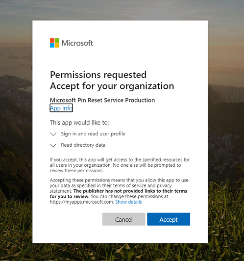
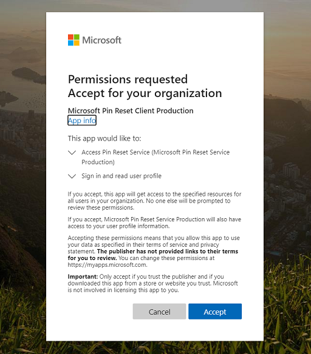
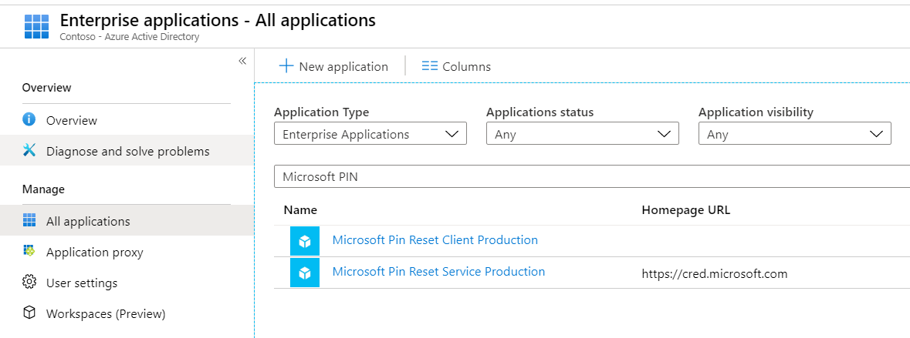

# PIN reset

**Applies to:**

- Windows 10, version 1709 or later

## Hybrid Deployments

**Requirements:**

- Azure Active Directory
- Hybrid Windows Hello for Business deployment
- Azure AD registered, Azure AD joined, and Hybrid Azure AD joined
- Windows 10, version 1709 to 1809, **Enterprise Edition**. There is no licensing requirement for this feature since version 1903.

The Microsoft PIN reset services enables you to help users recover who have forgotten their PIN.  Using Group Policy, Microsoft Intune or a compatible MDM, you can configure Windows 10 devices to securely use the Microsoft PIN reset service that enables users to reset their forgotten PIN through settings or above the lock screen without requiring re-enrollment.

>[!IMPORTANT]
> The Microsoft PIN Reset service only works with Windows 10, version 1709 to 1809 with **Enterprise Edition**.  The feature works with **Pro** edition with Windows 10, version 1903 and newer.

### Onboarding the Microsoft PIN reset service to your Intune tenant

Before you can remotely reset PINs, you must on-board the Microsoft PIN reset service to your Azure Active Directory tenant, and configure devices you manage.

### Connect Azure Active Directory with the PIN reset service

1. Go to the [Microsoft PIN Reset Service Production website](https://login.windows.net/common/oauth2/authorize?response_type=code&client_id=b8456c59-1230-44c7-a4a2-99b085333e84&resource=https%3A%2F%2Fgraph.windows.net&redirect_uri=https%3A%2F%2Fcred.microsoft.com&state=e9191523-6c2f-4f1d-a4f9-c36f26f89df0&prompt=admin_consent), and sign in using the tenant administrator account you use to manage your Azure Active Directory tenant.
2. After you log in, click **Accept** to give consent for the PIN reset service to access your account.

3. Go to the [Microsoft PIN Reset Client Production website](https://login.windows.net/common/oauth2/authorize?response_type=code&client_id=9115dd05-fad5-4f9c-acc7-305d08b1b04e&resource=https%3A%2F%2Fcred.microsoft.com%2F&redirect_uri=ms-appx-web%3A%2F%2FMicrosoft.AAD.BrokerPlugin%2F9115dd05-fad5-4f9c-acc7-305d08b1b04e&state=6765f8c5-f4a7-4029-b667-46a6776ad611&prompt=admin_consent), and sign in using the tenant administrator account you use to manage your Azure Active Directory tenant.
4. After you log in, click **Accept** to give consent for the PIN reset client to access your account.

5. In the [Azure portal](https://portal.azure.com), verify that the Microsoft PIN Reset Service and Microsoft PIN Reset Client are integrated from the **Enterprise applications** blade. Filter to application status "Enabled" and both Microsoft Pin Reset Service Production and Microsoft Pin Reset Client Production will show up in your tenant.

>[!NOTE]
>After you Accept the PIN reset service and client requests, you will land on a page that states "You do not have permission to view this directory or page." This behavior is expected. Be sure to confirm that the two PIN Reset applications are listed for your tenant.

### Configure Windows devices to use PIN reset using Group Policy

You configure Windows 10 to use the Microsoft PIN Reset service using the computer configuration portion of a Group Policy object.

1. Using the Group Policy Management Console (GPMC), scope a domain-based Group Policy to computer accounts in Active Directory.
2. Edit the Group Policy object from step 1.
3. Enable the **Use PIN Recovery** policy setting located under **Computer Configuration->Administrative Templates->Windows Components->Windows Hello for Business**.
4. Close the Group Policy Management Editor to save the Group Policy object.  Close the GPMC.

### Configure Windows devices to use PIN reset using Microsoft Intune

To configure PIN reset on Windows devices you manage, use an [Intune Windows 10 custom device policy](https://docs.microsoft.com/intune/custom-settings-windows-10) to enable the feature. Configure the policy using the following Windows policy configuration service provider (CSP):

#### Use an existing WHFB Device configuration profile using Microsoft Intune

If you already have got an existing configuration for Windows Hello for Business, you can enable the feature by enabling the Enable PIN recovery policy in your configuration.

If you do not have an existing configuration, you can create one following the steps below.

#### Create a PIN Reset Device configuration profile using Microsoft Intune

1. Sign-in to [Azure Portal](https://portal.azure.com) using a tenant administrator account.
2. Navigate to the Microsoft Endpoint Manager admin center. Click **Devices**. Click **Profiles**. Click **Configuration profiles**. Click **Create profile**.
3. Type **Use PIN Recovery** in the **Name** field. Select **Windows 10 and later** from the **Platform** list.  Select **Identity protection** from the **Profile type** list.
4. Click **Enable** on the "Configure Windows Hello for Business" option. 
5. Click **Enable** on the "Enable PIN recovery" option
6. Click **OK**
7. Click **Create**
8. Assign the policy to your user group.

 
#### Assign the PIN Reset Device configuration profile using Microsoft Intune

1. Sign-in to [Azure Portal](https://portal.azure.com) using a tenant administrator account. 
2. Navigate to the Microsoft Intune blade. Click **Device configuration**. Click **Profiles**. From the list of device configuration profiles, click the profile that contains the PIN reset configuration.
3. In the device configuration profile, click **Assignments**.
4. Use the **Include** and/or **Exclude** tabs to target the device configuration profile to select groups.

## On-premises Deployments

**Requirements**

* Active Directory
* On-premises Windows Hello for Business deployment
* Reset from settings - Windows 10, version 1703, Professional
* Reset above Lock - Windows 10, version 1709, Professional

On-premises deployments provide users with the ability to reset forgotten PINs either through the settings page or from above the user's lock screen.  Users must know or be provided their password for authentication, must perform a second factor of authentication, and then re-provision Windows Hello for Business.

>[!IMPORTANT]
>Users must have corporate network connectivity to domain controllers and the federation service to reset their PINs.

### Reset PIN from Settings

1. Sign-in to Windows 10, version 1703 or later using an alternate credential.
2. Open **Settings**, click **Accounts**, click **Sign-in options**.
3. Under **PIN**, click **I forgot my PIN** and follow the instructions.

#### Reset PIN above the Lock Screen

 1. On Windows 10, version 1709, click **I forgot my PIN** from the Windows Sign-in
 2. Enter your password and press enter.
 3. Follow the instructions provided by the provisioning process
 4. When finished, unlock your desktop using your newly created PIN.

>[!NOTE]
> Visit the [Windows Hello for Business Videos](https://docs.microsoft.com/windows/security/identity-protection/hello-for-business/hello-videos.md) page and watch the [Windows Hello for Business forgotten PIN user experience](https://docs.microsoft.com/windows/security/identity-protection/hello-for-business/hello-videos#windows-hello-for-business-forgotten-pin-user-experience) video.

## Related topics

- [Windows Hello for Business](hello-identity-verification.md)
- [Manage Windows Hello for Business in your organization](hello-manage-in-organization.md)
- [Why a PIN is better than a password](hello-why-pin-is-better-than-password.md)
- [Prepare people to use Windows Hello](hello-prepare-people-to-use.md)
- [Windows Hello and password changes](hello-and-password-changes.md)
- [Windows Hello errors during PIN creation](hello-errors-during-pin-creation.md)
- [Event ID 300 - Windows Hello successfully created](hello-event-300.md)
- [Windows Hello biometrics in the enterprise](hello-biometrics-in-enterprise.md)
