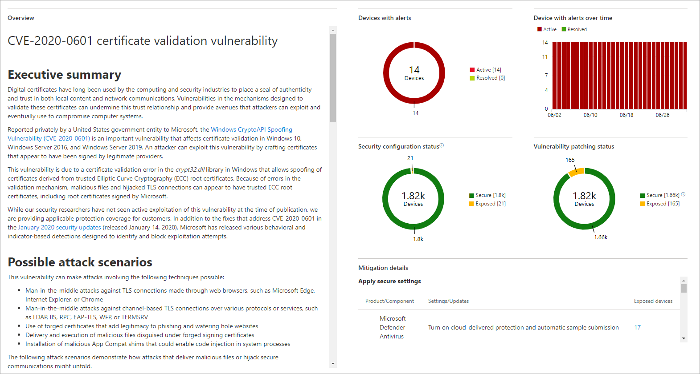

# Track and respond to emerging threats with threat analytics
**Applies to:**
- [Microsoft Defender Advanced Threat Protection (Microsoft Defender ATP)](https://go.microsoft.com/fwlink/p/?linkid=2069559)

Cyberthreats are emerging more frequently and prevalently. It is critical for organizations to quickly assess their security posture, covering the impact of emerging threats and their organizational resilience.

Threat analytics is a set of reports published by Microsoft security researchers as soon as emerging threats and outbreaks are identified. The reports help you assess the impact of threats to your environment and identify actions that can contain them.

Watch this short video to quickly understand how threat analytics can help you track the latest threats and stop them.

> [!VIDEO https://www.microsoft.com/en-us/videoplayer/embed/RE4bw1f]

## View the threat analytics dashboard

The threat analytics dashboard is a great jump off point for getting to the reports that are most relevant to your organization. It provides several overviews about the threats covered in the reports:

- **Latest threats** — lists the most recently published threat reports, along with the number of devices with resolved and unresolved alerts.
- **High-impact threats** — lists the threats that have had the highest impact on the organization in terms of the number of devices that have had related alerts, along with the number of devices with resolved and unresolved alerts.
- **Threat summary** — shows the number of threats among the threats reported in threat analytics with actual alerts.

Select a threat from any of the overviews or from the table to view the report for that threat.

## View a threat analytics report

Each threat report generally provides an overview of the threat and an analysis of the techniques and tools used by the threat. It also provides mitigation recommendations and detection information. It includes several cards that show dynamic data about how your organization is impacted by the threat and how prepared it is to stop the threat.

### Organizational impact
Each report includes cards designed to provide information about the organizational impact of a threat:
- **Devices with alerts** — shows the current number of distinct devices that have been impacted by the threat. A device is categorized as **Active** if there is at least one alert associated with that threat and **Resolved** if *all* alerts associated with the threat on the device have been resolved.
- **Devices with alerts over time** — shows the number of distinct devices with **Active** and **Resolved** alerts over time. The number of resolved alerts indicates how quickly your organization responds to alerts associated with a threat. Ideally, the chart should be showing alerts resolved within a few days.

### Organizational resilience
Each report also includes cards that provide an overview of how resilient your organization can be against a given threat:
- **Security configuration status** — shows the number of devices that have applied the recommended security settings that can help mitigate the threat. Devices are considered **Secure** if they have applied _all_ the tracked settings.
- **Vulnerability patching status** — shows the number of devices that have applied security updates or patches that address vulnerabilities exploited by the threat.
- **Mitigation details** — lists specific actionable recommendations that can help you increase your organizational resilience. This card lists tracked mitigations, including recommended settings and vulnerability patches, along with the number of devices that don't have the mitigations in place.

### Additional report details and limitations
When using the reports, keep the following in mind:

- Data is scoped based on your RBAC permissions. You will only see the status of devices that you have been granted access to on the RBAC.
- Charts reflect only mitigations that are tracked. Check the report overview for additional mitigations that are not reflected in the charts.
- Mitigations don't guarantee complete resilience. The provided mitigations reflect the best possible actions needed to improve resiliency.
- Devices are counted as "unavailable" if they have been unable to transmit data to the service.
- Antivirus related statistics are based on Microsoft Defender Antivirus settings. Devices with third-party antivirus solutions can appear as "exposed".
